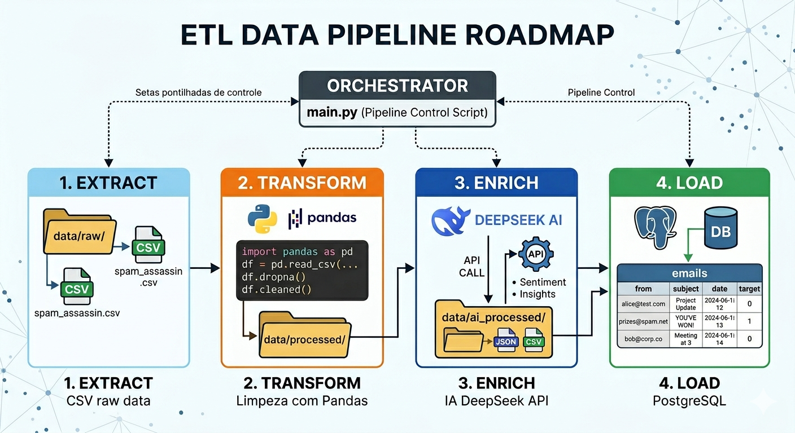

# 🚀 Pipeline ETL com IA (DeepSeek) + PostgreSQL

Projeto de Engenharia de Dados que implementa um pipeline completo de ETL com enriquecimento de dados via Inteligência Artificial (DeepSeek API), persistência em banco relacional PostgreSQL e organização em camadas de dados.

Este projeto foi desenvolvido como parte do bootcamp da TOTVS com foco em práticas modernas de Engenharia de Dados.

---

## 🎯 Problema de Negócio Resolvido

Empresas recebem milhares de e-mails diariamente e precisam classificar automaticamente mensagens como **spam** ou **não spam** para:

- Reduzir tempo de análise manual
- Melhorar segurança contra phishing e fraudes
- Otimizar a produtividade das equipes
- Garantir que e-mails importantes não sejam perdidos

Este pipeline automatiza o processamento, limpeza e enriquecimento de dados de e-mails, preparando um dataset estruturado para análise e modelagem de machine learning.

---

## 🧠 Visão Geral

O objetivo do projeto é processar dados de e-mails, realizar limpeza e transformação estrutural, enriquecer os dados utilizando IA e armazená-los em um banco relacional para consultas analíticas.

O pipeline segue uma arquitetura modular e escalável inspirada em práticas reais de engenharia de dados.

---

## 🏗️ Arquitetura do Pipeline

---

## ⚙️ Fluxo do Pipeline

'''
DATA RAW
   ↓
EXTRACT (leitura do CSV)
   ↓
TRANSFORM (limpeza e padronização)
   ↓
ENRICH (IA - DeepSeek API)
   ↓
LOAD (PostgreSQL)
'''

---

## 📁 Estrutura do Projeto

'''
codigos/
│
├── config/                 # Configurações do projeto
│   └── settings.py
│
├── data/
│   ├── raw/                # Dados originais
│   ├── processed/          # Dados limpos
│   └── ai_processed/       # Dados enriquecidos pela IA
│
├── src/
│   ├── extract/            # Extração dos dados
│   │   └── extract_emails.py
│   ├── transform/          # Limpeza e padronização
│   │   └── parse_email.py
│   ├── enrich/             # Enriquecimento via IA
│   │   └── enrich_emails.py
│   └── load/               # Carga no banco de dados
│       └── load_emails.py
│
├── main.py                 # Orquestrador do pipeline
├── requirements.txt        # Dependências
└── .env                    # Variáveis de ambiente
'''

---

## 🧪 Dataset

O dataset contém registros de e-mails com classificação de spam:

| Campo | Descrição |
|-------|-----------|
| from | Remetente do e-mail |
| subject | Assunto do e-mail |
| date | Data do envio |
| target | Classificação (0 = não spam, 1 = spam) |

---

## 🤖 Enriquecimento com IA

O projeto utiliza a API da DeepSeek para:

- Normalizar campos inconsistentes
- Padronizar textos (subject, email)
- Garantir estrutura consistente dos dados
- Melhorar qualidade do dataset para análise

---

## 🗄️ Banco de Dados

Os dados finais são armazenados em PostgreSQL:

'''sql
CREATE TABLE emails (
    id SERIAL PRIMARY KEY,
    sender VARCHAR(255),
    subject TEXT,
    email_date TIMESTAMP,
    target SMALLINT
);
'''

---

## 🧰 Tecnologias Utilizadas

| Tecnologia | Finalidade |
|------------|------------|
| Python 3.11+ | Linguagem principal |
| Pandas | Manipulação de dados |
| SQLAlchemy | Conexão com banco de dados |
| PostgreSQL | Banco de dados relacional |
| Requests | Chamadas à API DeepSeek |
| python-dotenv | Gerenciamento de variáveis de ambiente |
| DeepSeek API | Enriquecimento de dados com IA |

---

## ▶️ Como Executar

### 1. Clonar o repositório

'''bash
git clone <repo-url>
cd codigos
'''

### 2. Criar ambiente virtual

'''bash
python -m venv venv
venv\Scripts\activate     # Windows
# source venv/bin/activate  # Linux/Mac
'''

### 3. Instalar dependências

'''bash
pip install -r requirements.txt
'''

### 4. Configurar variáveis de ambiente

Criar arquivo `.env` na raiz do projeto:

'''env
DB_USER=postgres
DB_PASSWORD=sua_senha
DB_HOST=localhost
DB_PORT=5432
DB_NAME=emails_db

DEEPSEEK_API_KEY=sua_chave
'''

### 5. Executar pipeline

'''bash
python main.py
'''

---

## 📊 Resultados

O pipeline gera um dataset final estruturado:

| sender | subject | email_date | target |
|--------|---------|------------|--------|
| ... | ... | ... | ... |

Pronto para análise, dashboards ou modelos de Machine Learning.

---

## 🧠 Aprendizados

Este projeto explora conceitos importantes de Engenharia de Dados:

- Arquitetura ETL modular
- Integração com APIs de IA
- Data cleaning e normalização
- Persistência em banco relacional
- Organização de pipelines reais
- Boas práticas com variáveis de ambiente

---

## 🚀 Possíveis Melhorias

- Implementação de batch processing
- Deduplicação de dados (upsert)
- Logging estruturado
- Orquestração com Airflow ou Prefect
- Containerização com Docker
- Testes unitários para cada etapa do pipeline
- Dashboard para visualização dos resultados

---

## 📈 Badges do Projeto

'''

'''

---

## 👨‍💻 Autor

Projeto desenvolvido como parte do **Bootcamp TOTVS - Fundamentos de Engenharia de Dados e Machine Learning**.

**Rodrigo**

[GitHub](https://github.com/RodrigoSilvaPereira) | [LinkedIn](https://linkedin.com/in/rohsilva)

---

## 📄 Licença

Este projeto está sob a licença MIT - consulte o arquivo [LICENSE](../../LICENSE) para detalhes.

---

> [🏠 Voltar ao README principal](../../README.md) | [⬆ Módulo anterior: Fundamentos de ETL](../../3-BDR-ETL/3-Fundamentos-ETL/README.md)